# The Story of Why This Matters

*A plain-English guide to the PRIS Act and why every WA business owner should care.*

---

## Meet Dave

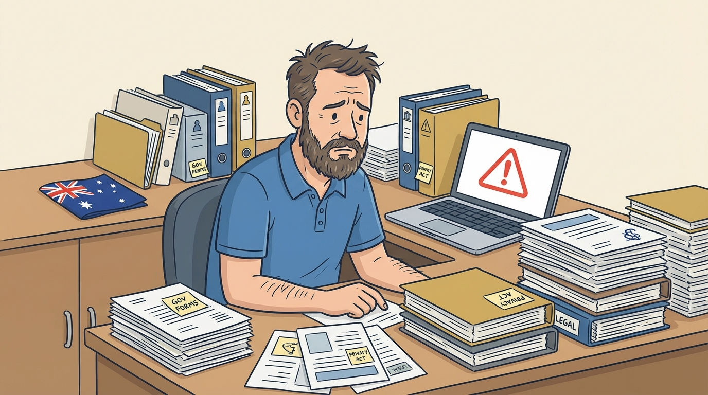

Dave is 40 years old. He runs a small IT consulting business in Perth. He's got 8 employees, a mortgage in Joondalup, two kids in school, and a dog named Biscuit.

Dave's business does well. About 60% of his revenue comes from government contracts — he provides IT support to a couple of WA state government departments. It's steady work. Good money. It keeps the lights on.

One morning, Dave gets an email from his biggest government client:

> *"Please confirm your organisation's compliance with the Privacy and Responsible Information Sharing Act 2024 (PRIS Act) by July 1, 2026. Non-compliant contractors may have their contracts reviewed."*

Dave stares at the screen. He's never heard of the PRIS Act.

---

## What Just Happened?

In 2024, the Western Australian Parliament passed a new law called the **Privacy and Responsible Information Sharing Act** (PRIS Act). It comes into full effect on **July 1, 2026**.

Here's what it does, in plain English:

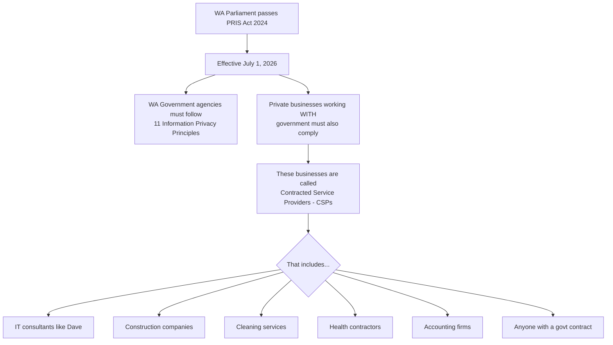

The key word is **Contracted Service Provider (CSP)**. If your business has a contract with any WA state government agency, you are legally required to handle personal information according to the same privacy standards as the government itself.

---

## Why Should Dave Care?

Because the consequences are real:

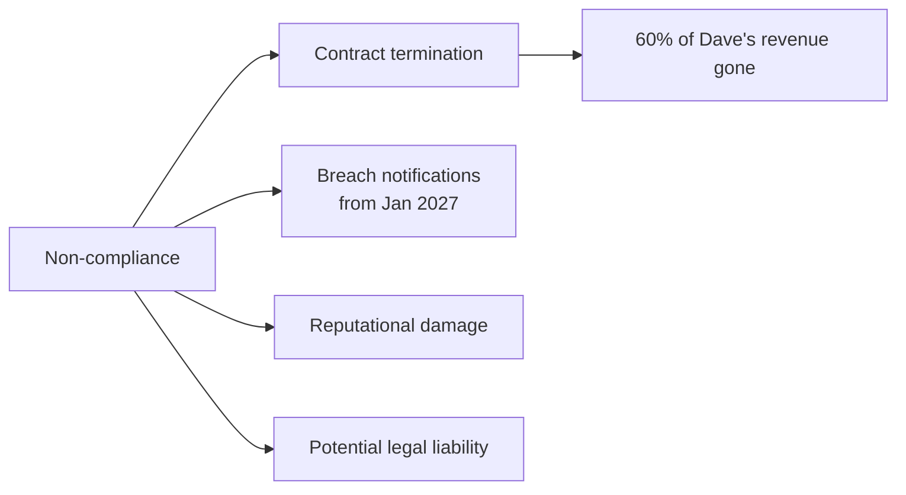

Dave's government contracts are worth $400,000 a year. If he can't demonstrate compliance, those contracts are at risk. Not "might be at risk" — **the government is legally required to ensure their contractors comply**.

---

## What Does "Comply" Actually Mean?

The PRIS Act has **11 Information Privacy Principles (IPPs)**. Think of them as 11 rules for handling people's personal information:

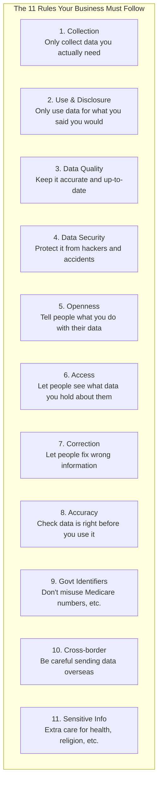

On top of these 11 principles, the PRIS Act also requires businesses to:

- **Designate a Privacy Officer** — someone in your team responsible for privacy
- **Conduct Privacy Impact Assessments** — when starting new projects that handle personal data
- **Keep records** of what personal data you hold, where it's stored, and who can access it
- **Report data breaches** to authorities (mandatory from January 1, 2027)

---

## Dave's Problem

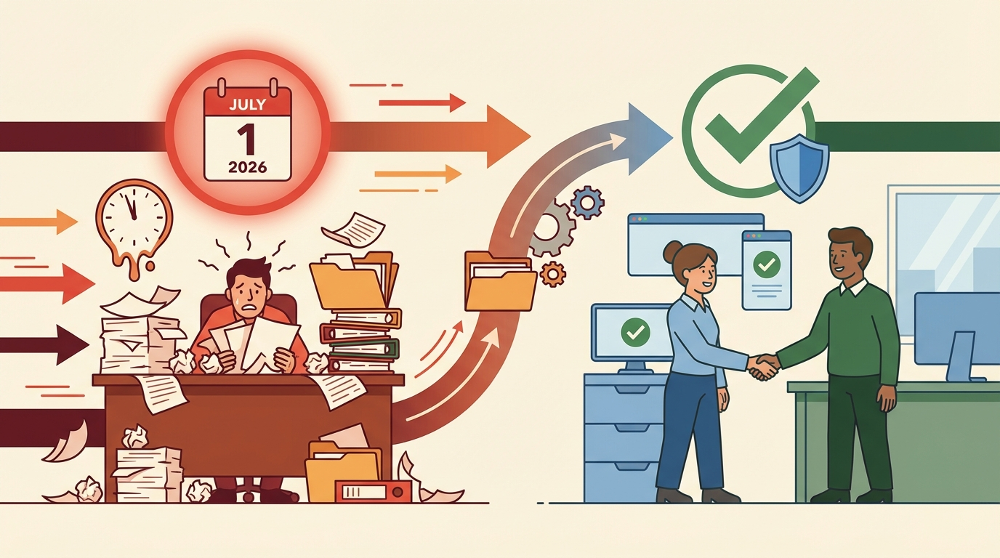

Dave is a great IT consultant. But he's not a privacy lawyer. He's now facing a wall of requirements:

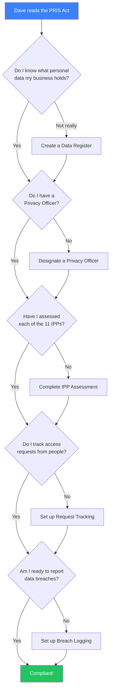

Dave could hire a privacy consultant. That'll cost **$5,000 to $15,000**. Or a law firm. That's even more. For a small business with 8 employees, that's a painful expense.

And here's the thing — it's not a one-time job. Compliance is **ongoing**. Dave needs to:
- Track requests every time someone asks to see their data
- Update his data register when things change
- Log any security incidents
- Review his Privacy Impact Assessments regularly
- Keep an audit trail proving he's doing all of this

---

## This Is Where We Come In

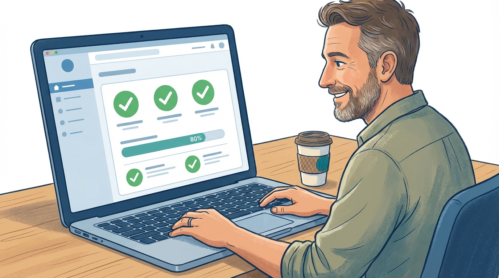

The **PRIS Act Compliance Portal** is a simple web app that guides Dave through everything he needs to do. No lawyers required. No $15,000 consulting fees.

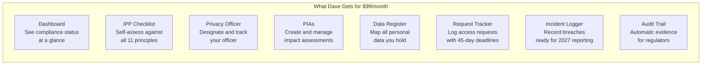

### How It Works for Dave

**Day 1:** Dave signs up, answers a few questions in the onboarding wizard, and designates himself as Privacy Officer.

**Day 2:** Dave goes through the IPP Checklist. For each of the 11 principles, he answers whether he's compliant, partially compliant, or not yet. The portal tells him what to focus on.

**Day 3:** Dave adds his data holdings to the Data Register. He discovers he holds employee records in 3 different systems — something he didn't even realize was a compliance risk.

**Week 2:** Dave creates his first Privacy Impact Assessment for a new project. The portal guides him through the questions and tracks the approval workflow.

**Ongoing:** When someone asks to see their personal data, Dave logs it in the Request Tracker. The portal automatically sets a 45-day deadline (as required by the PRIS Act) and reminds him before it's due.

**If something goes wrong:** Dave logs the incident in the Breach Logger. When mandatory breach reporting kicks in on January 1, 2027, he already has a complete, timestamped record.

---

## But Why Does This Matter for Regular Australians?

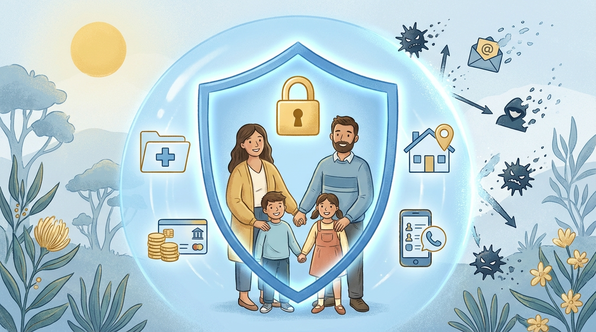

Here's the part most people miss. The PRIS Act isn't just about businesses and paperwork. **It's about protecting you and your family.**

Every time you interact with a government service in WA — when your kids enrol in school, when you visit a public hospital, when you get a building permit, when you apply for a concession card — your personal information gets shared with private companies that help deliver those services.

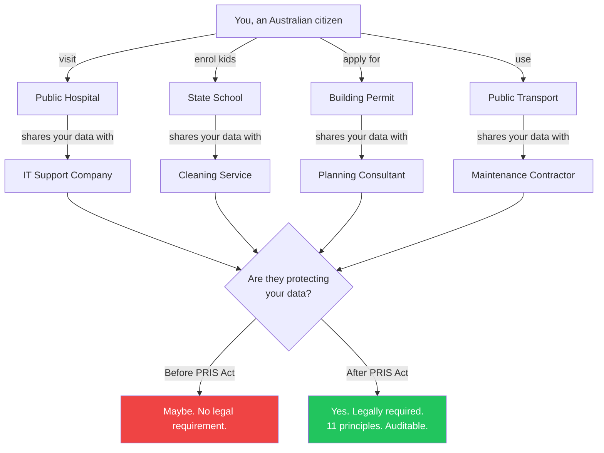

Before the PRIS Act, those private companies had **no specific legal obligation** to protect your data to government standards. Your medical records, your children's school information, your home address — it was all handled on a best-effort basis.

The PRIS Act changes that. Now every contractor must follow the same 11 privacy principles as the government itself. And tools like the PRIS Act Compliance Portal make it **affordable and practical** for small businesses to actually do it.

**When Dave complies, your data is safer.** That's the whole point.

---

## The Bigger Picture

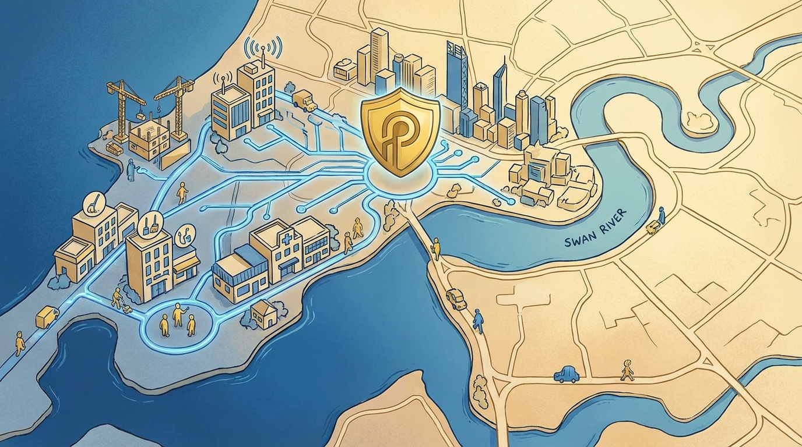

The PRIS Act affects **thousands** of businesses across Western Australia. Every IT consultancy, every construction firm, every cleaning company, every health service provider that holds a government contract.

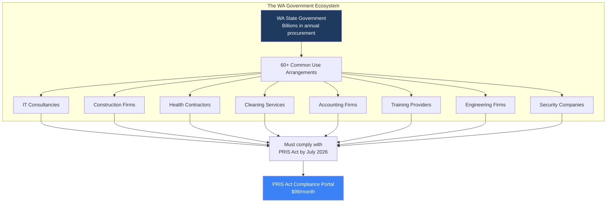

Most of these are small businesses. They can't afford $15,000 privacy consultants. They don't have in-house legal teams. They need something **simple, affordable, and purpose-built** for exactly this situation.

That's what we built. And we built it in a single day, for $54, using autonomous AI.

---

## The Timeline

Here's what's coming:

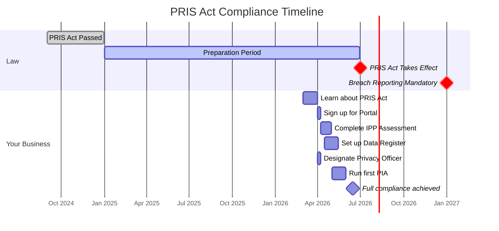

---

## In Summary

| Question | Answer |
|----------|--------|
| **What is the PRIS Act?** | WA's new privacy law, effective July 1, 2026 |
| **Who does it affect?** | Any business with a WA government contract |
| **What do I need to do?** | Follow 11 privacy principles, designate a Privacy Officer, keep records |
| **What happens if I don't?** | Risk losing government contracts, legal liability from 2027 |
| **How much does compliance cost?** | $5K-15K with consultants, **$99/month with the Portal** |
| **How long does it take?** | Weeks with consultants, **days with the Portal** |

---

*The PRIS Act Compliance Portal is built by [MyImaginationAI](https://github.com/valter-silva-au) — affordable, transparent, AI-powered solutions for every Australian business.*

*Built autonomously by [Agent Loops](https://github.com/valter-silva-au/agent-loops) in a single day for $54 in API costs.*
